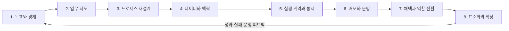

# 8단계 업무 전환 생애주기

## 목적

이 생애주기는 AI 기능을 만드는 순서가 아니라, 한 업무를 운영 가능한 변화로 만들기 위해 놓치지 말아야 할 여덟 관점이다.

여덟 단계는 검증된 산업 표준이나 준수 인증이 아니라, 이 저장소가 업무 전환의 누락을 줄이기 위해 제안하는 반복형 작업 모델이다.

## 사용하는 방법

- 처음부터 여덟 단계를 완벽하게 문서화하지 않는다.
- 업무 위험이 낮으면 얇게 통과하고 실제 증거를 얻는다.
- 데이터·권한·복구가 준비되지 않으면 자율 실행 범위를 높이지 않는다.
- 운영 중 새 제약이 발견되면 앞 단계로 돌아간다.
- 각 단계의 통과 기준을 충족하지 못해도 구현을 강행하지 않는다.

## 단계

1. [목표와 경계](01-outcomes-and-boundaries.md)
2. [업무 지도](02-workflow-discovery.md)
3. [프로세스 재설계](03-process-redesign.md)
4. [데이터와 맥락](04-data-and-context.md)
5. [실행 계약과 통제](05-execution-contracts.md)
6. [배포와 운영](06-production-deployment.md)
7. [채택과 역할 전환](07-adoption-and-change.md)
8. [표준화와 확장](08-standardization-and-scale.md)

## 공통 완료 질문

- 누가 이 업무 결과를 사용하고 최종 책임지는가?
- 입력과 출력은 다른 사람이 확인할 수 있는가?
- AI가 하지 못하는 행동과 사람 승인 지점이 분명한가?
- 실패를 탐지하고 중단·복구할 수 있는가?
- 기존 업무보다 나아졌다는 근거가 있는가?
- 운영 책임을 다른 사람에게 넘길 수 있는가?
- 다음 업무에서 재사용할 부분과 버릴 부분을 구분했는가?
