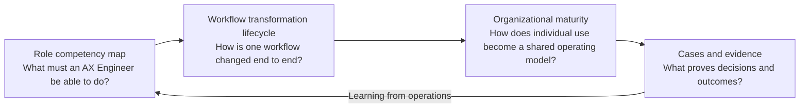

# AX Engineer Roadmap Korea

[](../LICENSE)
[](README.md)
[](CHANGELOG.md)

[한국어](../README.md) | [English](README.md)

An evidence-oriented field guide for **AX Engineers** who deploy AI into real work and turn it into an operable way of working inside Korean organizations.

This is not a catalog of technologies. It connects the decisions an AX Engineer must make, the systems they must build, and the evidence they must leave behind.

> An AX Engineer's deliverable is not a demo.
>
> It is a system and way of working that people use in real operations, that makes failures visible, and that another person can safely take over.

## Why this roadmap exists

Introducing AI tools does not automatically transform how an organization works. Teams may create dashboards and automations independently, but inconsistent inputs, outputs, validation, and records make handoff difficult. They also make failures hard to trace and proven approaches hard to reuse.

In this repository, an **AX Engineer** is an engineer who discovers internal workflow problems, redesigns processes, and connects AI to existing data, systems, and permissions to produce an operable change. Rather than claim a universal job-title definition, the roadmap focuses on the following responsibilities:

- Find high-value workflows and real bottlenecks.
- Distinguish steps to eliminate or simplify from steps where AI can help.
- Connect data, software, models, permissions, and human approval into one workflow.
- Operate quality, cost, security, incidents, and adoption.
- Turn the learning from one use case into shared foundations and organizational practices.

[Read the role model](roadmap/role-model.md)

## What this roadmap means by an organizational AI operating model

An organizational AI operating model is not a super-agent that centralizes every piece of data and every permission. It is a shared foundation that lets teams choose the tools and implementation styles they need while safely exchanging and operating work products.

At a minimum, the organization should be able to inspect:

- where systems of record and documents live;
- input and output contracts and workflow identifiers;
- completion and quality validation, including human approval points;
- permission, audit, change, and version history;
- failure detection, stop, recovery, and manual fallback paths;
- operating status for cost, quality, adoption, and workflow outcomes.

The target state of AX is therefore not “automate every task.” It is the organizational capability to discover new workflows, test them safely, deploy them into operations, and improve or stop them when the evidence calls for it.

## Four maps

The roadmap keeps role readiness, the transformation of one workflow, and organizational maturity separate.



1. [Role competency map](roadmap/competency-map.md): competencies from problem discovery through organizational scale
2. [Eight-stage workflow transformation lifecycle](delivery-lifecycle/README.md): the path from an existing workflow to an operable one
3. [Organizational AX maturity](organization-maturity/README.md): the progression from individual use to an adaptive operating model
4. [Cases and evidence](case-studies/beauty-d2c-voc/README.md): how to record hypotheses, decisions, failures, and outcomes

## Eight-stage workflow transformation lifecycle

The eight stages are not a waterfall to pass through once. Revisit them at the depth required for each new workflow.

| Stage | Core question | Document |
|---|---|---|
| 1. Outcomes and boundaries | What will change, and what must AI not do? | [Read](delivery-lifecycle/01-outcomes-and-boundaries.md) |
| 2. Workflow discovery | What is the real workflow, and where are the bottlenecks? | [Read](delivery-lifecycle/02-workflow-discovery.md) |
| 3. Process redesign | Are we automating work that should be removed or simplified? | [Read](delivery-lifecycle/03-process-redesign.md) |
| 4. Data and context | What is the source of truth, and do shared terms mean the same thing? | [Read](delivery-lifecycle/04-data-and-context.md) |
| 5. Execution contracts and controls | What are the input, output, permission, approval, and recovery rules? | [Read](delivery-lifecycle/05-execution-contracts.md) |
| 6. Production deployment | How does a prototype become a reliable production workflow? | [Read](delivery-lifecycle/06-production-deployment.md) |
| 7. Adoption and role change | What must change for the new way of working to become official? | [Read](delivery-lifecycle/07-adoption-and-change.md) |
| 8. Standardization and scale | How does one success become a repeatable organizational capability? | [Read](delivery-lifecycle/08-standardization-and-scale.md) |

## How to read each competency

Every competency follows the same structure.

```text
Understand    Can you explain the concepts and principles?
Decide        Can you choose according to constraints and risk?
Practice      Have you done it under realistic constraints?
Demonstrate   Is there an artifact or record another person can verify?
Failure modes Can you recognize and avoid common errors in judgment?
```

Proficiency is defined by the scope of deployment responsibility, not tenure or the number of tools used.

- **Foundation**: structure a workflow and validate a bounded prototype.
- **Builder**: deploy one workflow into a real operating environment.
- **Operator**: continuously operate quality, cost, incidents, permissions, and adoption.
- **Lead**: extract common patterns across workflows and scale them across the organization.

[Read the proficiency levels](roadmap/proficiency-levels.md)

## Where to start

### Developer preparing to become an AX Engineer

1. Read the [role model](roadmap/role-model.md) to understand the responsibilities and boundaries.
2. Use the [competency map](roadmap/competency-map.md) to find areas where you lack evidence.
3. Follow the [12-week practice path](learning-paths/12-week-practice.md) to build one end-to-end workflow transformation case.

### Practitioner already responsible for AX work

1. Diagnose the current state with the [organizational maturity model](organization-maturity/README.md).
2. Record candidates with the [workflow discovery card](toolkit/workflow-discovery-card.md).
3. Select the first workflow with the [use-case scorecard](toolkit/use-case-scorecard.md).
4. Follow the eight-stage lifecycle through operations, adoption, and handoff.

### Leader designing an AX team or transformation program

1. Use the [role model](roadmap/role-model.md) to divide responsibilities among the central team, business teams, IT, data, and security.
2. Use the [organizational maturity model](organization-maturity/README.md) to define the target level and mandatory controls.
3. Start a shared work contract with the [execution contract](toolkit/execution-contract.md) and [evidence ledger](toolkit/evidence-ledger.md).

## First public case

[Beauty/D2C global VOC to action proposal](case-studies/beauty-d2c-voc/README.md) is a practice case built around public data.

```text
Collect VOC
→ Preserve original text and provenance
→ Detect issues and opportunities
→ Verify evidence
→ Propose action
→ Human approval
→ Record execution status and outcomes
```

It is not an internal diagnosis of a specific company. It is a learning simulation based on publicly observable workflow patterns, with verified facts kept separate from hypotheses.

## Project principles

- Start with the workflow, not a platform choice.
- Align the minimum contract for input, output, validation, approval, records, and recovery rather than forcing one tool.
- Respect systems of record and data ownership.
- Increase autonomy according to workflow risk and recoverability.
- Measure model quality and business outcomes separately.
- Design the conditions for retiring or retaining the old manual process.
- Do not claim impact without field evidence.
- Do not turn an unvalidated structure from one case into an organization-wide standard.

## Out of scope

- A career roadmap for roles that deploy products into external customer environments
- Rankings of models, cloud providers, or agent frameworks
- A blueprint in which AI performs every task
- An architecture that centralizes all enterprise data and permissions in one super-agent
- Unsourced claims about productivity, cost, or revenue improvement
- Certification programs or employment guarantees

## Evidence and contributions

[Review of public AX Engineer roles](research/ax-engineer-role-review.md) explains the recurring responsibilities found in current public role and practitioner materials and the editorial decisions behind this roadmap. Contributions are welcome when they add gaps, counterexamples, production cases, or better validation methods.

- Propose incorrect or outdated material with a `Source update` issue.
- Open a `Roadmap gap` issue for a missing competency or lifecycle stage.
- Submit de-identified cases with a `Case study proposal`.
- Follow the [contribution guide](CONTRIBUTING.md) and [source policy](research/source-policy.md).

## Status and license

- Current version: `v0.1.0`
- Reference date: `2026-07-23`
- Status: initial public edition focused on the AX Engineer role
- License: [MIT](../LICENSE)
