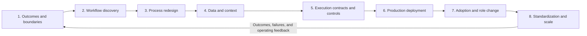

# Eight-Stage Workflow Transformation Lifecycle

## Purpose

This lifecycle is not an order for building AI features. It is a set of eight perspectives that prevent critical omissions while turning one workflow into an operable change.

The stages are not a validated industry standard or compliance certification. They are an iterative working model proposed by this repository.

## How to use it

- Do not fully document all eight stages before learning anything.
- Move through low-risk work thinly and gather real evidence.
- Do not raise autonomous execution when data, permissions, or recovery are not ready.
- Return to an earlier stage when operations reveal a new constraint.
- Do not force implementation when a stage's exit criteria are unmet.

## Stages

1. [Outcomes and boundaries](01-outcomes-and-boundaries.md)
2. [Workflow discovery](02-workflow-discovery.md)
3. [Process redesign](03-process-redesign.md)
4. [Data and context](04-data-and-context.md)
5. [Execution contracts and controls](05-execution-contracts.md)
6. [Production deployment](06-production-deployment.md)
7. [Adoption and role change](07-adoption-and-change.md)
8. [Standardization and scale](08-standardization-and-scale.md)

## Shared completion questions

- Who uses the workflow outcome, and who is ultimately accountable?
- Can another person inspect the input and output?
- Are prohibited AI actions and human approval points explicit?
- Can failures be detected, stopped, and recovered?
- Is there evidence that the new workflow is better than the old one?
- Can operating responsibility be handed over?
- Have reusable and disposable parts been distinguished for the next workflow?
