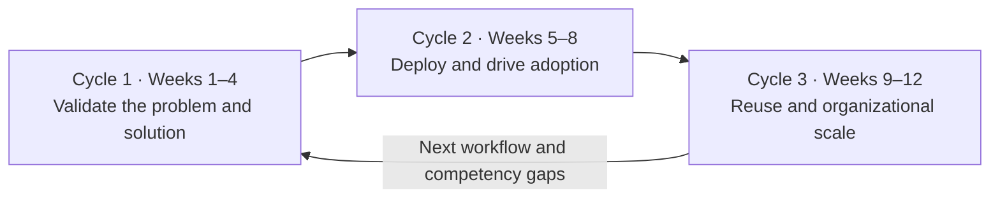

# AX Engineer 12-Week Practice Path

## Goal

Instead of reading technologies in sequence, spend twelve weeks discovering and implementing one workflow, then reuse what proved valuable in a second workflow. The organization track tests production operations and adoption. The public simulation track practices deployment and recovery in a validation environment. Every week should preserve not only outputs, but the reasoning and verifiable evidence behind them.

## Principles before starting

- If real organizational data is unavailable, begin with public, synthetic, or non-sensitive data.
- Define the measurement method and baseline before creating impact claims.
- Add actions that change external systems only after human approval and recovery paths are ready.
- Every week, decide `continue / revise / hold / stop` and record the evidence.
- Preserve workflow identifiers, evaluation, approvals, and records even when changing tools or models.

## Choose a practice track

Choose a track according to your access to organizational systems and users. The deliverables may look similar, but their evidentiary strength differs.

| Area | Organization track | Public simulation track |
|---|---|---|
| Data | Approved non-sensitive or masked data | Public or synthetic data |
| Systems | Real development, test, and production environments | Sandboxes, test doubles, and personal environments |
| Users | Real workflow users and operators | Independent reviewers and simulated roles |
| What it can verify | Production deployment, adoption, handoff, and procedure change | Design, implementation, evaluation, recovery practice, and usability feedback |
| What it cannot claim | Unmeasured organizational impact | Real production adoption, official procedure change, or organizational impact |

A public simulation can provide valid technical and judgment evidence for role preparation. By itself, it is not evidence of Builder- or Operator-level production responsibility. Mark the case title and outcomes as a `simulation`.

## Cycle 1. Validate the problem and solution

### Week 1: Select a workflow and establish a baseline

- Distinguish users, process owners, and people who may be harmed.
- Compare three workflow candidates by value, frequency, evidence, data, risk, and recoverability.
- Record the current flow, bottlenecks, waiting, and exceptions.
- Define success and stop conditions plus initial non-goals.

Evidence:

- [Workflow discovery card](../toolkit/workflow-discovery-card.md)
- [Use-case scorecard](../toolkit/use-case-scorecard.md)
- Current workflow
- Baseline and outcome contract

### Week 2: Redesign the process and define the data contract

- Reclassify current steps as remove, combine, standardize, AI assist, human approval, or automatic execution.
- Identify systems of record and data owners.
- Define rules for inputs, outputs, workflow terminology, missingness, and conflicts.
- Draw the target flow and manual fallback.

Evidence:

- Current-to-target workflow comparison
- Responsibility matrix
- Data and schema contract
- Glossary and manual fallback

### Week 3: Build a trustworthy assistive feature

- Implement only the necessary level of search, classification, summary, or proposal.
- Make source text, provenance, and version traceable from every result.
- Let a person revise, hold, or reject results and record the reason.
- Do not add capabilities unrelated to the workflow.

Evidence:

- Thin vertical prototype
- Executable code and tests
- Input and output examples
- Decision and correction records

### Week 4: Evaluate and make the first gate decision

- Build an evaluation set with normal, edge, and failure cases.
- Measure quality, groundedness, safety, latency, and cost where relevant.
- Reproduce invalid data, model failures, and permission errors.
- Decide whether to proceed to production deployment, revise, hold, or stop.

Evidence:

- Evaluation data and adjudication criteria
- Evaluation results and failure taxonomy
- Model, prompt, and tool versions
- [Experiment card](../toolkit/experiment-card.md)

## Cycle 2. Production deployment and adoption

### Week 5: Define execution contracts and integration

- Separate what AI may read, propose, and execute.
- Define human approval points and criteria by role.
- Design APIs, events, identifiers, and failure boundaries for connected systems.
- Define stop conditions for data exposure, invalid actions, duplicate execution, and excessive cost.

Evidence:

- [Execution contract](../toolkit/execution-contract.md)
- Permission and approval matrix
- API, event, and identifier contracts
- Threat model and integration design

### Week 6: Implement integration and controls

- Connect at least two real systems or sandbox adapters.
- Implement authentication, authorization, secrets, deduplication, retries, and state persistence.
- Record execution, approval, outcomes, and failures under the same identifier.
- Separate development, test, and production for the organization track; separate local and test for the public simulation.
- Have another developer reproduce the core flow in a test environment.

Evidence:

- Executable code and integration tests
- Deployment and environment configuration
- Audit and change records
- Developer handoff

### Week 7: Deploy, observe, and recover

- In the organization track, deploy to production for a bounded group and scope.
- In the public simulation, deploy to a validation environment isolated from production.
- In both tracks, observe quality, latency, cost, and error states.
- Record real adoption in the organization track and independent-review usability problems in the simulation.
- Inject external outages, stale data, invalid results, and permission errors.
- Exercise stop, rollback, and manual fallback.

Evidence:

- Operating status report or dashboard
- Alerts and runbook
- Incident and recovery exercise
- Cost, quality, and reliability review

### Week 8: User acceptance and workflow transition

- In the organization track, have an operator other than the implementer handle representative and exception flows.
- In the public simulation, have an independent reviewer reproduce the same flow using only the documentation.
- Observe correction burden, repeat use, support requests, and workflow outcomes or usability problems.
- In the organization track, hand off training, support, inquiry channels, and operating responsibility, then decide the old process's state.
- In the public simulation, document review limits without claiming production adoption or procedure change.

Evidence:

- User acceptance or independent-review record
- Training and support documentation
- Adoption and workflow-outcome review, or simulation limitations
- Old-process retirement or retention decision, or simulated transition conditions

## Cycle 3. Reuse and organizational scale

### Week 9: Select a second workflow and define its contract

- Select a workflow similar to the first but different in user, data, or risk.
- Classify existing contracts and components as reusable unchanged, configurable, or newly implemented.
- Adapt target flow, data contract, execution scope, and evaluation criteria to the second workflow.
- Separate technical barriers to reuse from genuine workflow differences.
- Do not force the first case's structure as the answer.

Evidence:

- Second workflow discovery card
- Cross-case difference table
- Reuse hypothesis
- New scope and stop conditions

### Week 10: Redeploy for the second workflow

- Use contracts, code, and templates from the first workflow to implement the second thin vertical slice.
- Separate unchanged reuse from configuration and code changes.
- Connect authentication, approval, records, and recovery for the second workflow.
- Remove or reverse abstractions for the first workflow if they obstruct the second.

Evidence:

- Executable code for the second workflow
- Reuse, configuration, and new-implementation list
- Integration and regression tests
- Change-decision record

### Week 11: Evaluate reuse and acceptance

- Run normal, edge, and failure evaluation plus recovery exercises for the second workflow.
- Have real users and operators review in the organization track, or independent reviewers in the public simulation.
- Compare time, change scope, and operating burden with the first workflow.
- Separate reused parts, failed abstractions, and parts demonstrated in only one case.
- Decide to standardize, retain, revise, or retire each part based on evidence.

Evidence:

- Evaluation and recovery records for the second workflow
- User acceptance or independent-review record
- Cross-case reuse comparison
- Standardize, retain, revise, or retire decision

### Week 12: Standardize and complete the case

- Extract only contracts validated across both workflows—input, output, evaluation, approval, records, and recovery—into the shared harness.
- Define versioning, compatibility, extension points, retirement policy, and the boundary of team autonomy.
- In the organization track, document responsibilities across the central AX team, business, IT, data, and security, plus current maturity.
- In the public simulation, distinguish assumptions about the target organization and permissions from verified facts.
- Present problem, choices, implementation, failures, operations, adoption, and reuse as one case.
- Put outcomes, limitations, and claims not made in the same document.
- Use the [competency map](../roadmap/competency-map.md) and [proficiency levels](../roadmap/proficiency-levels.md) to identify remaining gaps.

Evidence:

- Shared contracts and extension points
- Version and compatibility policy
- Organizational responsibility and maturity diagnosis, or simulation assumptions
- [Case-study document](../toolkit/case-study-template.md)
- [Evidence ledger](../toolkit/evidence-ledger.md)
- Learning and execution plan for the next twelve weeks

## Questions to repeat every week

- What new fact was verified this week?
- Which hypothesis was wrong?
- What is the largest risk or operating burden?
- Did user behavior actually change?
- What should be retained or discarded next week?
- If the project stops now, is there still explainable evidence?

## Completion criteria

- Within the selected track, one workflow connects discovery through deployment and acceptance.
- Normal, edge, and failure evaluation plus recovery records exist.
- Someone other than the implementer has directly tested the core flow and representative exceptions.
- Reused parts and failed abstractions from the second workflow can be explained.
- The boundary between shared organizational criteria and team autonomy is documented.
- Outcomes and limitations are visible in the same case.

Additional completion criteria for the organization track:

- Real operating scope, user adoption, handoff, and the old process's state are verified.

Additional completion criteria for the public simulation track:

- Sandbox or test environment and independent-review scope are disclosed.
- No claims are made about production adoption, official procedure change, or organizational impact.
