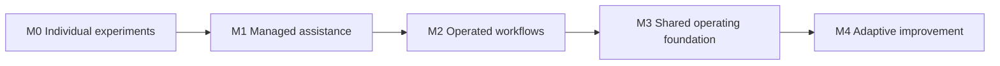

# Organizational AX Maturity Model

## 1. Purpose

This model measures not how many AI tools an organization uses, but how safely it can add, operate, and improve critical workflows.

It is not a score assigned to the entire organization. Different workflows and departments may sit at different levels, and keeping a high-risk workflow at low autonomy may be the more mature decision.

M0 through M4 are not validated industry standards or certification criteria. They are a practical diagnostic model proposed by this repository to compare AX operating states.

## 2. Five levels

### M0. Individual experiments

- Individuals use general-purpose generative AI tools for documents, analysis, and code.
- Input, output, quality, and security criteria depend on the individual.
- Other people cannot easily reproduce or take over the result.
- The organization may observe usage but cannot connect it to workflow outcomes.

Conditions for the next level:

- allowed and prohibited data plus basic usage rules;
- recurring workflow candidates and accountable owners;
- a method for reviewing results and preserving evidence.

### M1. Managed assistance

- Low-risk workflows use search, summaries, drafts, and proposed options.
- People retain final judgment and execution.
- Evaluation cases and output formats are defined per workflow.
- Experiments have criteria to scale, improve, or stop.

Conditions for the next level:

- data and execution contracts;
- an operating environment and access permissions;
- failure detection, recovery, and user acceptance.

### M2. Operated workflows

- AI capabilities connect to existing systems and are used in official workflows.
- Authentication, permissions, approval, audit, observability, and recovery operate in practice.
- Model quality and workflow outcomes are reviewed together.
- Operating responsibility and the state of the old procedure are explicit.

Conditions for the next level:

- recurring patterns demonstrated in at least two workflows;
- version, compatibility, and change policies;
- safe boundaries within which business teams may make adjustments.

### M3. Shared operating foundation

- Teams may use different technologies but share a minimum work contract.
- Systems of record, permissions, execution, evaluation, audit, and cost are visible through shared foundations.
- A procedure and templates exist for adding new workflows.
- The central AX team manages foundations and criteria instead of implementing every workflow itself.

Conditions for the next level:

- self-sufficient business-team operations and improvement;
- portfolio-level investment and stop decisions;
- an operating review that feeds failure and outcome evidence into the next standard.

### M4. Adaptive improvement

- Business teams propose, evaluate, operate, and improve workflows within approved boundaries.
- The central organization focuses on high-risk approvals, shared foundations, and quality and security criteria.
- Operational failures and reuse patterns feed back into foundations, policies, and training.
- Old procedures and shared assets are retired when evidence no longer supports them.

M4 does not mean automatic execution for every workflow. It includes the mature decision to retain human judgment and approval for high-risk work.

## 3. Diagnostic dimensions

| Dimension | M0 | M1 | M2 | M3 | M4 |
|---|---|---|---|---|---|
| Workflow portfolio | Individual choice | Candidates and experiment criteria | Operating-workflow review | Organizational priorities | Continuous investment and stop decisions |
| Data | Personal files | Workflow-level sources | Contracts, owners, and lineage | Shared semantics and access foundation | Quality feedback changes contracts and improvement reviews |
| Execution | Copy and paste | Human execution | Approved and bounded execution | Shared execution policy | Safe business-team extension |
| Evaluation | Subjective checks | Workflow-specific cases | Regression and production evaluation | Shared evaluation contracts | Failures improve standards |
| Controls | Individual judgment | Hard boundaries | Permissions, audit, and recovery | Central policy with team boundaries | Continuous risk-based adjustment |
| Adoption | Voluntary use | Bounded users | Official procedures and handoff | Training, support, and autonomy | Continuous role and procedure improvement |
| Reuse | None | Template candidates | Reuse within a workflow | Shared foundation across teams | Learning organizational operating model |

## 4. Maturity assessment rules

- Do not declare a high level by averaging scores.
- If mandatory controls such as security, accountability, or recovery are missing, do not rate that workflow M2 or higher.
- Do not generalize pilot success into organizational maturity.
- Record differences among departments instead of reducing the entire organization to its lowest level.
- Set the target level according to workflow value and risk.

## 5. First completion point for AX transformation

There is no permanent completion state for the whole organization. However, the organization can say that a **first operating model exists** when:

- it has a prioritized portfolio of critical workflows;
- every operated workflow has data, execution, and evaluation contracts;
- human and AI permissions, approvals, and accountability are explicit;
- execution, change, approval, and recovery history is traceable;
- model quality, workflow outcomes, adoption, cost, and reliability are reviewed together;
- business teams can propose and operate new workflows on shared foundations;
- the central AX team is not the bottleneck for every routine operation;
- criteria exist for retiring both old procedures and shared assets.
