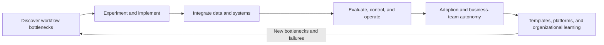

# Review of Public AX Engineer Roles

> Verified: 2026-07-23

## Purpose

`AX Engineer` is not yet a title with one settled scope. This document examines recurring responsibilities and differences in current public job and practitioner materials, then explains what this roadmap includes.

It does not treat one company's definition as a standard or claim statistical representation of the entire hiring market. Public materials may change or expire, so each source includes a link and verification date.

## Review criteria

- Whose workflow problem does the role start from?
- How far does it implement and operate directly?
- How does it handle data, systems, and permissions?
- How does it evaluate model and agent quality?
- Does it own adoption and role change?
- How does it reuse learning from one case?

## Role shapes found in public materials

### 1. Domain-embedded

FuriosaAI's Compiler AX Engineer posting describes a role embedded in a specific engineering team. It identifies bottlenecks in development, review, debugging, CI, and documentation; tests AI tools in the real workflow; and turns results into repeatable tools and playbooks. It tracks workflow measures such as pull-request cycle time, review time, issue-triage time, and CI flakiness—not only adoption.

Important competencies in this shape:

- observing domain work directly and structuring bottlenecks;
- comparing tools with real baselines rather than feature lists;
- operating team-specific templates, integrations, and guidance;
- viewing training and adoption metrics alongside technical outcomes.

Source:

- [`PRIMARY_OFFICIAL` FuriosaAI, Software Engineer, Compiler (AX Engineer)](https://jobs.ashbyhq.com/furiosa-ai/11eafd2e-d89b-4c61-bb64-b38cf0748536/) — verified 2026-07-23

### 2. Organizational operating foundation

Lunit's Senior AX Engineer posting frames approval flows, internal-policy questions, collaboration-tool and data connections, and workflow SDKs and runtimes as one organizational operating foundation. Rather than having one team build every application, it aims to let non-engineering functions create workflows within approved boundaries.

Important competencies in this shape:

- connecting data, identifiers, and permissions across systems of record;
- defining shared contracts for agent execution, evaluation, approval, audit, and recovery;
- building SDKs, templates, and runtimes for adding new workflows;
- setting the boundary between central foundations and team autonomy;
- treating security, governance, and operations as part of implementation.

Source:

- [`PRIMARY_OFFICIAL` Lunit, Senior AX Engineer](https://apply.workable.com/lunit/j/E3C22F589F/) — verified 2026-07-23

### 3. Business-team autonomy and adoption

A public post from Rapport Labs' AX team describes helping employees resolve real blockers through usage sessions and one-on-one support. The focus is not a tool introduction by itself, but a real workflow problem and the user's ability to solve the next problem independently.

This roadmap derives the following competencies from that case:

- separating reasons for non-use into technical, workflow, trust, and accessibility problems;
- operating office hours, guides, examples, and support channels;
- designing safe boundaries within which business teams may build or edit;
- recording recurring blockers as candidates for improving guidance, support, or technical foundations.

Source:

- [`PRIMARY_OFFICIAL` Rapport Labs, 월간 AX: AI를 실제로 쓰게 만들려면?](https://blog.rapportlabs.kr/%EC%9B%94%EA%B0%84-ax-ai%EB%A5%BC-%EC%8B%A4%EC%A0%9C%EB%A1%9C-%EC%93%B0%EA%B2%8C-%EB%A7%8C%EB%93%A4%EB%A0%A4%EB%A9%B4-156677) — verified 2026-07-23

## Recurring responsibilities

The organizations, domains, and seniority levels differ, but the following loop recurs.

Shared responsibilities:

1. Verify the workflow problem and baseline before applying AI.
2. Connect prototypes to real systems and permission structures.
3. Operate execution, approval, incidents, and cost—not only model output.
4. Treat training and documentation as part of adoption, not an add-on.
5. Preserve each solution as templates, playbooks, SDKs, or shared foundations.

## Differences

| Difference | Domain-embedded | Organizational operating foundation | Business-team autonomy and adoption |
|---|---|---|---|
| First users | A specific domain team | Multiple functions and internal builders | Employees starting or blocked in AI use |
| Main deliverables | Workflow-specific tools, integrations, and playbooks | Data, execution, evaluation, and permission foundations | Guides, support systems, and reusable cases |
| Representative risk | Local optimization and duplicate implementation | Platform-first thinking and over-abstraction | Mistaking training volume for workflow change |
| Scaling path | Reuse patterns in adjacent workflows | Shared contracts and self-service | Business-team autonomy and fewer recurring support requests |

One job posting may include all three shapes. The table is not intended to split the role into three jobs; it shows which responsibilities receive emphasis.

The three operating models in the [role model](../roadmap/role-model.md) describe where an AX Engineer sits in an organization. The three shapes in this document describe which responsibilities public materials emphasize. They are independent and may be combined.

## Editorial decisions for this roadmap

### Focus on internal AX

This repository does not cover career tracks that deploy a product into external customer environments. Even when the technology overlaps, organizational relationships, success criteria, reuse paths, and handoff responsibilities differ.

### Use deployment responsibility as the learning unit

Prompting, RAG, agents, and automation tools are necessary competencies, but they do not describe the entire role. The unit of learning is evidence connecting one workflow from problem discovery through operations, adoption, and standardization.

### Separate individual proficiency from organizational maturity

One excellent person producing a successful case does not mean the organization has transformed. Individual proficiency, the transformation lifecycle of one workflow, and organizational AX maturity remain separate maps.

### Define the shared harness as a minimum work contract

The roadmap does not force one model, framework, or UI. It aligns compatibility for systems of record, inputs, outputs, validation, approval, records, permissions, and recovery. A structure is not promoted to an enterprise standard until reuse has been demonstrated in a second workflow.

### Do not treat job postings as permanent truth

A job posting reflects one organization's needs at one point in time. The roadmap uses it alongside practitioner cases, operating artifacts, and contributor counterexamples—not as the only source for defining the role.
