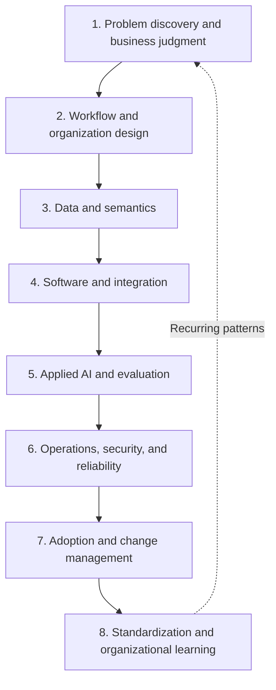

# AX Engineer Competency Map

## 1. Competency structure

AX Engineer competencies are grouped into eight areas. Not every person needs the same depth in every area, but deploying a workflow into operations requires a named owner for each one.

## 2. Problem discovery and business judgment

### Understand

- Differences among workflow outcomes, user outcomes, and technical outcomes
- Baselines and success metrics
- Leading and lagging indicators
- Cost of automation, cost of failure, and cost of inaction

### Decide

- Distinguish a problem for AI from a process that should be removed or simplified.
- Defer a high-value workflow when data, permissions, or recovery are not ready.
- Choose to build, improve, maintain, or stop based on evidence.

### Practice

- Create three workflow discovery cards from interviews or a public case.
- Compare candidates by value, frequency, data, risk, and recoverability.
- Explain success and stop conditions without naming a tool.

### Demonstrate

- Outcome contract
- Baseline and metric definitions
- Use-case scorecard
- Decision record with scope and non-goals

### Failure modes

- Treating an executive idea as the problem definition without validation
- Using token volume, user count, or generated-item count as business impact
- Measuring time saved without checking where that time goes

## 3. Workflow and organization design

### Understand

- Triggers, owners, inputs, decisions, outputs, exceptions, and handoffs
- Difference between process owners and system operators
- Current-state and target-state flows
- Parallel operation and retirement conditions for the old process

### Decide

- Distinguish steps that require human judgment from steps that can be standardized as rules.
- Define the minimum information required at cross-department handoffs.
- Detect structures that make the central AX team a permanent bottleneck.

### Practice

- Map the current flow of a real or simulated workflow.
- Reclassify steps as remove, combine, standardize, AI assist, approve, or auto-execute.
- Create a responsibility matrix and operational handoff plan.

### Demonstrate

- Current and target workflow maps
- Responsibility matrix
- Exception and manual fallback paths
- Decision on retirement of the old process

### Failure modes

- Adding one AI feature to every existing step
- Writing only “a human reviews it” without criteria or an owner
- Introducing a new tool while leaving official procedures and KPIs unchanged

## 4. Data and semantics

### Understand

- Systems of record and derived data
- Schemas, data contracts, freshness, and lineage
- Workflow terms and metric definitions
- Quality and sampling bias in structured and unstructured data

### Decide

- Do not store document retrieval and live workflow state in the same way.
- Distinguish data to replicate from data to query at its source.
- Explain the effects of missing, conflicting, or stale data.

### Practice

- Separate source, transformed, analyzed, and executed results for one workflow.
- Write a data contract and glossary.
- Build evaluation data that reproduces missing, duplicate, delayed, and permission-error cases.

### Demonstrate

- Data and schema contracts
- System-of-record and owner map
- Glossary and metric definitions
- Data-quality report

### Failure modes

- Treating a vector database as the organization's system of record
- Removing provenance and collection scope, then comparing only model accuracy
- Trying to fix conflicting team definitions with a prompt

## 5. Software and integration

### Understand

- APIs, authentication and authorization, events, queues, webhooks, and batch jobs
- Relational data models and transactions
- Retries, deduplication, and idempotency
- Testing, CI/CD, configuration, and secret management

### Decide

- Choose synchronous or asynchronous, batch or event-driven execution according to workflow needs.
- Define the boundary between experiment code and production code.
- Decide whether to retain an existing SaaS interface or build a separate UI or service.

### Practice

- Build a thin vertical slice connecting at least two existing systems.
- Include authentication, permissions, failure handling, deduplication, and audit logs.
- Let another developer reproduce it in a local or test environment.

### Demonstrate

- Executable code and tests
- API and event contracts
- Deployment pipeline
- Operational and developer handoff documentation

### Failure modes

- A demo works but does not persist state, permissions, or failures
- Automatic retries duplicate external actions
- The system depends on one person's local environment or personal account

## 6. Applied AI and evaluation

### Understand

- Model inputs, outputs, and nondeterminism
- Retrieval, RAG, tool-use, and agent patterns
- Offline and production evaluation
- Correctness, groundedness, safety, latency, and cost

### Decide

- Choose the necessary level among deterministic rules, retrieval, classification, generation, and agents.
- Do not deploy requirements that cannot be evaluated.
- Distinguish better model performance from better workflow outcomes.

### Practice

- Create an evaluation set with normal, edge, and failure cases.
- Run regression evaluation before and after model, prompt, retrieval, or tool changes.
- Implement rules that stop unsafe results or hand them to a person.

### Demonstrate

- Evaluation data and adjudication criteria
- Evaluation results and regression history
- Model, prompt, and tool versions
- Failure taxonomy and improvement decisions

### Failure modes

- Declaring quality after seeing a few good examples
- Treating an LLM evaluator score as an absolute standard without human review
- Expanding execution permissions because model outputs look good

## 7. Operations, security, and reliability

### Understand

- Least privilege, data classification, and secret management
- Logs, metrics, traces, and audit records
- SLOs, incident response, rollback, and manual fallback
- Cost limits and usage controls

### Decide

- Set AI autonomy and approval points according to workflow risk.
- Choose automatic retry, immediate stop, or human handoff by failure type.
- Distinguish data that must be recorded from data that must not be stored.

### Practice

- Inject permission failures, external API outages, stale data, and invalid outputs.
- Exercise alerting, stop, recovery, and rollback.
- Let operators trace cause and impact with the same identifier.

### Demonstrate

- Threat model and permission matrix
- Operating dashboard or status report
- Incident and recovery exercise records
- Cost, quality, and reliability scorecard

### Failure modes

- Mistaking chat history for an audit log
- Defining only that “a human handles it” when something fails
- Expanding autonomous execution without observability

## 8. Adoption and change management

### Understand

- User acceptance testing
- Training, support, and local champions
- Parallel operation, SOP change, and role redesign
- Differences among adoption, satisfaction, and workflow outcomes

### Decide

- Distinguish whether non-use comes from training, trust, accessibility, or process conflict.
- Separate what the business team may edit from what requires engineering changes.
- Decide when to retain or retire the old process.

### Practice

- Have an operator other than the implementer complete the core flow without verbal guidance.
- Separate user feedback into feature requests and workflow problems.
- Operate training, support, handoff, and retirement conditions.

### Demonstrate

- User acceptance records
- Training and support documentation
- Workflow adoption metrics
- Decision to retire or retain the old process

### Failure modes

- Judging adoption only by logins or generated-item counts
- Treating business-team resistance as a lack of willingness to change
- Making the AX team the permanent owner of all exceptions and change requests

## 9. Standardization and organizational learning

### Understand

- One-off requirements and recurring patterns
- Configurability, extension points, and version compatibility
- Shared-foundation feedback and platform backlog
- Case reproducibility and evidence records

### Decide

- Do not promote a requirement from one case into a shared feature.
- Set the boundary between common contracts and team autonomy.
- Turn operational failures into reproducible shared-foundation problems.

### Practice

- Reuse existing contracts and components in a second workflow.
- Record what was not reused and why.
- Compare time, change scope, and operating burden when adding the new workflow.

### Demonstrate

- Reusable modules and version policy
- Playbooks and templates
- Shared-foundation or platform feedback
- Cross-case comparison and scale or stop decision

### Failure modes

- Declaring the first case an enterprise standard
- Using “shared harness” to force one framework and UI
- Adding every local exception to the core

## 10. Self-assessment

For each area, record the highest stage backed by **evidence another person can verify**, not the highest stage you understand conceptually.

| Competency | Understand | Decide | Practice | Demonstrate | Next evidence |
|---|---:|---:|---:|---:|---|
| Problem discovery and business judgment |  |  |  |  |  |
| Workflow and organization design |  |  |  |  |  |
| Data and semantics |  |  |  |  |  |
| Software and integration |  |  |  |  |  |
| Applied AI and evaluation |  |  |  |  |  |
| Operations, security, and reliability |  |  |  |  |  |
| Adoption and change management |  |  |  |  |  |
| Standardization and organizational learning |  |  |  |  |  |
