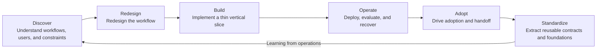

# AX Engineer Role Model

## 1. Definition used in this repository

An **AX Engineer** is an engineer who discovers internal workflow problems, redesigns processes, and connects AI to existing data, systems, and permissions to produce an operable change.

The title and scope still vary by organization. Some companies emphasize automation development embedded in a business or engineering team. Others assign agent execution foundations and internal data integration. Some roles place more weight on tool operations, training, and adoption.

This roadmap therefore looks past the title and asks whether the role includes these responsibilities:

- discovering workflow bottlenecks and setting technical scope;
- deciding whether to remove, simplify, standardize, or apply AI to the current process;
- integrating existing data and systems;
- implementing and deploying into operations;
- evaluation, security, observability, and recovery;
- adoption and operational handoff;
- turning repeatable patterns into shared foundations.

The evidence from current public role descriptions is documented in [Review of public AX Engineer roles](../research/ax-engineer-role-review.md).

## 2. Where the responsibility ends

An AX Engineer's responsibility does not end when a prototype works. One cycle ends when workflow outcomes are connected to operating accountability and another person can safely take over.

This does not mean the AX Engineer owns every decision. They work with process owners, data owners, security and legal teams, and existing system operators. Their responsibility is to connect technical outcomes with operational evidence.

## 3. Three operating models

Role placement varies with organizational size and AX maturity.

| Operating model | Where the AX Engineer sits | Strength | Watch for |
|---|---|---|---|
| Business-embedded | Within a specific function or domain team | Close to real bottlenecks and user feedback | Team silos and duplicated implementation |
| Central AX team | Enterprise platform or transformation organization | Easier to share data, permission, evaluation, and execution foundations | Platform work getting ahead of workflow problems |
| Hub and spoke | A central foundation team supports business-side builders | Combines shared controls with domain speed | Blurred ownership and support boundaries |

Early on, one person may cover all three models. As the number of cases grows, split responsibilities so discovery, implementation, operations, and support do not accumulate into a single bottleneck.

This table describes where AX Engineers sit in the organization. It is a separate axis from the mix of workflow transformation, foundation, and adoption responsibilities an individual carries. Multiple combinations can exist within one operating model.

## 4. Three responsibility axes within the role

### Workflow transformation

- Observe the real sequence, exceptions, waiting time, and handoffs.
- Find steps to remove or simplify before adding AI.
- Agree on outcomes, baselines, and success and stop conditions with the process owner.
- Align official procedures, roles, and KPIs with the new way of working.

### Engineering foundation

- Connect systems of record, workflow terminology, access permissions, and system boundaries.
- Choose only the necessary level of models, retrieval, rules, and tool calls.
- Implement evaluation, execution records, approvals, observability, cost limits, and recovery.
- Turn recurring contracts and components into a shared harness.

### Adoption and organizational learning

- Have users perform representative flows and exceptions themselves.
- Design training, support, edit permissions, and handoff criteria.
- Distinguish usage from workflow outcomes.
- Preserve failure, stop, and retirement reasons—not only successes—as criteria for the next workflow.

One role does not have to own all three axes deeply. But to deploy a workflow into operations, the organization must be able to name the owner for each axis.

## 5. Role boundaries

An AX Engineer is not solely responsible for organizational change.

| Responsibility | Primary owner | AX Engineer's role |
|---|---|---|
| Workflow outcomes and final decisions | Process owner | Make outcomes measurable and explain technical constraints |
| Definition and quality of source data | Data owner | Design contracts, validation, and missing-data handling |
| Security policy and exception approval | Security and legal owners | Document threats and access paths, then implement controls |
| Reliability of existing systems | System operator | Co-design integration, failure, and recovery |
| AI workflow system implementation | AX and engineering owners | Implement or co-implement and provide operating evidence |
| Adoption and procedure change | Organizational and process owners | Design acceptance, training, support, parallel operation, and retirement conditions |
| Shared foundations and investment order | AX lead and executive owner | Present options grounded in case evidence and technical debt |

Do not assign the following to an AX Engineer by default:

- independently setting enterprise AI strategy and performance targets without evidence;
- defining workflow terms and systems of record in place of data owners;
- approving risk exceptions in place of security or legal owners;
- permanently taking over every user inquiry and manual task;
- expanding agent permissions without recovery and approval criteria.

## 6. Questions that reveal a sound AX Engineer role

- What workflow outcome is expected in the first 90 days?
- How far does the role own problem discovery, implementation, operations, and scale?
- Does it have the access and collaboration path needed for existing systems and data?
- Who decides workflow priority and when to stop?
- How does the role work with security, data, and process owners?
- Who operates quality, cost, incidents, and user support after deployment?
- Is there a path from one implementation to a shared foundation?
- What may business users edit directly, and what requires an engineering change?
- Are there criteria for retiring the old process or removing the new system?

## 7. Warning signs in a role definition

- Success means only “use more AI.”
- The role cannot discover problems and only processes incoming automation requests.
- It is expected to build operating systems without data, permission, or deployment access.
- Security and approvals are assumed to be someone else's unspecified responsibility.
- Shipping a feature counts as complete even if users do not adopt it.
- A shared platform is required before reuse has been demonstrated in a second workflow.
- The central AX team becomes the permanent owner of every change, support request, and exception.
