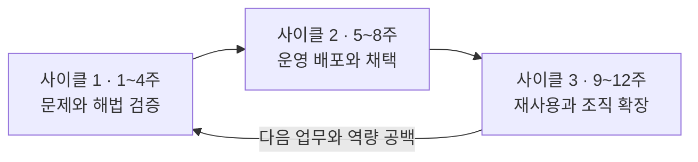

# AX Engineer 12주 실습 경로

## 목표

12주 동안 기술을 순서대로 읽는 대신, 하나의 업무를 발견·구현한 뒤 두 번째 업무에서 재사용한다. 조직 실전 트랙은 운영과 채택까지 확인하고, 공개 시뮬레이션 트랙은 검증 환경에서 배포·복구를 연습한다. 매주 결과물보다 판단 근거와 확인 가능한 증거를 함께 남긴다.

## 시작 전 원칙

- 실제 조직 데이터가 없다면 공개·합성·비민감 데이터로 시작한다.
- 성과 수치를 만들기보다 측정 방법과 기준선을 먼저 정한다.
- 외부 시스템을 변경하는 실행은 사람 승인과 복구 경로가 준비된 뒤 추가한다.
- 매주 `계속 / 수정 / 보류 / 중단` 중 하나를 근거와 함께 결정한다.
- 도구와 모델을 바꾸더라도 업무 식별자, 평가, 승인, 기록은 이어지게 만든다.

## 실습 트랙 선택

조직 시스템과 사용자에게 접근할 수 있는지에 따라 시작 전에 트랙을 고른다. 두 트랙의 산출물은 같아 보일 수 있지만 증거의 강도는 다르다.

| 구분 | 조직 실전 트랙 | 공개 시뮬레이션 트랙 |
|---|---|---|
| 데이터 | 승인받은 비민감·마스킹 데이터 | 공개·합성 데이터 |
| 시스템 | 실제 개발·테스트·운영 환경 | 샌드박스·테스트 더블·개인 환경 |
| 사용자 | 실제 업무 사용자와 운영자 | 독립 검토자와 가상 역할 |
| 확인 가능한 것 | 운영 배포, 채택, 인수인계, 절차 변경 | 설계, 구현, 평가, 복구 연습, 사용성 피드백 |
| 주장할 수 없는 것 | 측정하지 않은 조직 성과 | 실제 운영 채택, 공식 절차 변경, 조직 성과 |

공개 시뮬레이션은 직무 준비에 유효한 기술·판단 증거지만, 그 자체로 Builder·Operator 수준의 운영 증거는 아니다. 사례 제목과 결과에 `시뮬레이션`임을 표시한다.

## 사이클 1. 문제와 해법 검증

### 1주차: 업무 선택과 기준선

- 사용자·업무 책임자·피해 가능 사용자를 구분한다.
- 업무 후보 세 개를 가치·빈도·근거·데이터·위험·복구 가능성으로 비교한다.
- 선택한 업무의 현재 흐름, 병목, 대기, 예외를 기록한다.
- 성공·중단 조건과 초기 비목표를 정한다.

증거:

- [업무 발굴 카드](../toolkit/workflow-discovery-card.md)
- [업무 후보 평가표](../toolkit/use-case-scorecard.md)
- 현재 업무 흐름
- 기준선과 목표 계약

### 2주차: 프로세스 재설계와 데이터 계약

- 현재 단계를 제거·통합·표준화·AI 보조·사람 승인·자동 실행으로 다시 분류한다.
- 사실의 기준이 되는 원본 시스템과 데이터 소유자를 정한다.
- 입력·출력·업무 용어·누락·충돌 처리 규칙을 작성한다.
- 목표 흐름과 수동 대체 경로를 그린다.

증거:

- 현재/목표 업무 흐름
- 책임 배분표
- 데이터·스키마 계약
- 용어집과 수동 대체 경로

### 3주차: 신뢰 가능한 보조 기능

- 검색·분류·요약·제안 중 필요한 수준만 구현한다.
- 결과에서 원문·출처·버전을 역추적할 수 있게 한다.
- 사람이 결과를 수정·보류·기각하고 이유를 남기게 한다.
- 업무와 무관한 기능은 추가하지 않는다.

증거:

- 얇은 수직 프로토타입
- 실행 가능한 코드와 테스트
- 입력·출력 예시
- 결정 및 수정 기록

### 4주차: 평가와 첫 번째 통과 결정

- 정상·경계·실패 사례를 포함한 평가 세트를 만든다.
- 품질, 근거성, 안전성, 지연시간, 비용을 필요한 범위에서 측정한다.
- 잘못된 데이터, 모델 실패, 권한 오류를 재현한다.
- 운영 배포로 넘어갈지 수정·보류·중단할지 결정한다.

증거:

- 평가 데이터와 판정 기준
- 평가 실행 결과와 실패 분류
- 모델·프롬프트·도구 버전
- [실험 카드](../toolkit/experiment-card.md)

## 사이클 2. 운영 배포와 채택

### 5주차: 실행 계약과 통합 설계

- AI가 읽고, 제안하고, 실행할 수 있는 범위를 먼저 구분한다.
- 사람 승인 지점과 승인 기준을 역할별로 정한다.
- 연결할 시스템의 API·이벤트·식별자와 실패 경계를 설계한다.
- 데이터 노출, 오작동, 중복 실행, 과도한 비용의 중단 조건을 정한다.

증거:

- [실행 계약](../toolkit/execution-contract.md)
- 권한·승인표
- API·이벤트·식별자 계약
- 위협 모델과 통합 설계

### 6주차: 시스템 통합과 통제 구현

- 두 개 이상의 실제 시스템이나 샌드박스 어댑터를 연결한다.
- 인증·인가, 시크릿, 중복 방지, 재시도, 상태 저장을 구현한다.
- 실행·승인·결과·실패를 같은 식별자로 기록한다.
- 조직 실전 트랙은 개발·테스트·운영 환경을, 공개 시뮬레이션은 로컬·테스트 환경을 구분한다.
- 다른 개발자가 테스트 환경에서 핵심 흐름을 재현하게 한다.

증거:

- 실행 가능한 코드와 통합 테스트
- 배포·환경 구성
- 감사·변경 기록
- 개발자 인수인계

### 7주차: 배포·관측·복구

- 조직 실전 트랙은 제한된 사용자와 범위로 운영에 배포한다.
- 공개 시뮬레이션은 운영과 분리된 검증 환경에 배포한다.
- 두 트랙 모두 품질·지연·비용·오류 상태를 관찰한다.
- 조직 실전 트랙은 실제 채택 상태를, 공개 시뮬레이션은 독립 검토자의 사용성 문제를 기록한다.
- 외부 장애, 오래된 데이터, 잘못된 결과, 권한 오류를 주입한다.
- 중단·롤백·수동 대체 흐름을 실제로 실행한다.

증거:

- 운영 상태 보고 또는 대시보드
- 경보와 runbook
- 장애·복구 훈련 기록
- 비용·품질·안정성 리뷰

### 8주차: 사용자 검수와 업무 전환

- 조직 실전 트랙은 구현자 외의 운영자가 대표 흐름과 예외를 직접 처리하게 한다.
- 공개 시뮬레이션은 독립 검토자가 설명서만 보고 같은 흐름을 재현하게 한다.
- 수정 부담, 반복 사용, 지원 요청, 업무 결과 또는 사용성 문제를 확인한다.
- 조직 실전 트랙은 교육·지원·문의 경로와 운영 책임을 인계하고 기존 절차의 상태를 결정한다.
- 공개 시뮬레이션은 운영 채택과 절차 변경을 주장하지 않고 검토 한계를 기록한다.

증거:

- 사용자 검수 또는 독립 검토 기록
- 교육·지원 문서
- 채택·업무 결과 리뷰 또는 시뮬레이션 한계
- 기존 절차 종료·유지 결정 또는 가상 전환 조건

## 사이클 3. 재사용과 조직 확장

### 9주차: 두 번째 업무 선택과 계약

- 첫 업무와 비슷하지만 사용자·데이터·위험 중 하나가 다른 업무를 고른다.
- 기존 계약과 구성 요소를 그대로 재사용, 설정 변경, 새 구현으로 나눈다.
- 목표 흐름, 데이터 계약, 실행 범위, 평가 기준을 두 번째 업무에 맞게 작성한다.
- 재사용이 어려운 이유를 기술 문제와 업무 차이로 구분한다.
- 첫 사례의 구조를 정답으로 강제하지 않는다.

증거:

- 두 번째 업무 발굴 카드
- 사례 간 차이표
- 재사용 가설
- 새 범위와 중단 조건

### 10주차: 두 번째 업무 재배포

- 첫 업무의 계약·코드·템플릿을 사용해 두 번째 얇은 수직 기능을 구현한다.
- 그대로 재사용한 부분과 설정·코드 변경이 필요했던 부분을 분리한다.
- 두 번째 업무의 인증·승인·기록·복구 흐름을 연결한다.
- 첫 업무를 위한 추상화가 두 번째 업무를 방해하면 제거하거나 되돌린다.

증거:

- 두 번째 업무의 실행 가능한 코드
- 재사용·설정 변경·새 구현 목록
- 통합·회귀 테스트
- 변경 결정 기록

### 11주차: 재사용 평가와 검수

- 두 번째 업무에서도 정상·경계·실패 평가와 복구 훈련을 실행한다.
- 조직 실전 트랙은 실제 사용자·운영자, 공개 시뮬레이션은 독립 검토자가 대표 흐름을 확인한다.
- 새 업무 추가에 든 시간·변경 범위·운영 부담을 첫 업무와 비교한다.
- 재사용된 부분, 실패한 추상화, 아직 한 사례에서만 확인된 부분을 나눈다.
- 공통화·유지·수정·폐기 중 하나를 근거와 함께 결정한다.

증거:

- 두 번째 업무의 평가·복구 기록
- 사용자 검수 또는 독립 검토 기록
- 사례 간 재사용 비교
- 공통화·유지·수정·폐기 결정

### 12주차: 표준화와 사례 완성

- 두 업무에서 검증된 입력·출력·평가·승인·기록·복구 계약만 공통 하네스로 추출한다.
- 버전·호환성·확장 지점·폐기 정책과 팀 자율성의 경계를 정한다.
- 조직 실전 트랙은 중앙 AX팀·현업·IT·데이터·보안의 책임과 현재 성숙도를 정리한다.
- 공개 시뮬레이션은 목표 조직과 권한에 대한 가정을 실제 사실과 구분한다.
- 문제, 선택, 구현, 실패, 운영, 채택, 재사용을 하나의 사례로 정리한다.
- 성과와 한계, 주장하지 않는 내용을 같은 문서에 쓴다.
- [역량 지도](../roadmap/competency-map.md)와 [숙련도 기준](../roadmap/proficiency-levels.md)으로 남은 공백을 찾는다.

증거:

- 공통 계약과 확장 지점
- 버전·호환성 정책
- 조직 책임·성숙도 진단 또는 시뮬레이션 가정
- [사례 문서](../toolkit/case-study-template.md)
- [근거 기록](../toolkit/evidence-ledger.md)
- 다음 12주의 학습·실행 계획

## 매주 반복할 질문

- 이번 주에 새로 확인한 사실은 무엇인가?
- 어떤 가설이 틀렸는가?
- 가장 큰 위험과 운영 부담은 무엇인가?
- 사용자에게 실제로 달라진 행동이 있는가?
- 다음 주에도 유지할 것과 버릴 것은 무엇인가?
- 지금 중단해도 설명 가능한 근거가 남아 있는가?

## 완료 조건

- 선택한 트랙 안에서 한 업무가 발견부터 배포·검수까지 연결됐다.
- 정상·경계·실패 평가와 복구 기록이 있다.
- 구현자 외의 사람이 핵심 흐름과 대표 예외를 직접 확인했다.
- 두 번째 업무에서 재사용한 부분과 실패한 추상화를 설명할 수 있다.
- 조직 공통 기준과 팀 자율성의 경계를 문서화했다.
- 성과와 한계를 같은 사례에서 확인할 수 있다.

조직 실전 트랙의 추가 완료 조건:

- 실제 운영 범위, 사용자 채택, 인수인계, 기존 절차의 상태를 확인했다.

공개 시뮬레이션 트랙의 추가 완료 조건:

- 샌드박스·테스트 환경과 독립 검토 범위를 공개했다.
- 운영 채택, 공식 절차 변경, 조직 성과를 주장하지 않았다.
