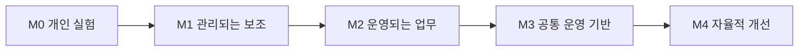

# 조직 AX 성숙도 모델

## 1. 목적

이 모델은 조직이 AI 도구를 얼마나 많이 쓰는지가 아니라, 핵심 업무를 얼마나 안전하게 추가·운영·개선할 수 있는지를 본다.

성숙도는 조직 전체에 하나의 점수를 붙이기 위한 평가표가 아니다. 업무와 부서마다 수준이 다를 수 있으며, 위험이 높은 업무는 낮은 자율성으로 유지하는 편이 더 성숙한 선택일 수 있다.

M0~M4는 검증된 산업 표준이나 인증 기준이 아니라, 이 저장소가 AX 운영 상태를 비교하기 위해 제안하는 실무 진단 모델이다.

## 2. 다섯 단계

### M0. 개인 실험

- 개인이 범용 생성형 AI 도구로 문서·분석·코드를 만든다.
- 입력·출력·품질·보안 기준이 개인에게 의존한다.
- 다른 사람이 결과를 재현하거나 이어받기 어렵다.
- 조직은 사용량을 알 수 있어도 업무 영향은 알기 어렵다.

다음 단계 조건:

- 허용·금지 데이터와 기본 사용 원칙
- 반복 업무 후보와 책임자
- 결과 검토와 근거 보존 방식

### M1. 관리되는 보조

- 저위험 업무에서 검색·요약·초안·선택지 제안을 사용한다.
- 사람이 최종 판단과 실행을 맡는다.
- 평가 사례와 결과 형식이 업무 단위로 정의된다.
- 실험을 확장·개선·중단하는 기준이 있다.

다음 단계 조건:

- 데이터·실행 계약
- 운영 환경과 접근 권한
- 실패 탐지·복구와 사용자 검수

### M2. 운영되는 업무

- AI 기능이 기존 시스템과 연결돼 공식 업무에서 사용된다.
- 인증·권한·승인·감사·관측성·복구가 동작한다.
- 모델 품질과 업무 결과를 함께 검토한다.
- 운영 책임과 기존 절차의 상태가 분명하다.

다음 단계 조건:

- 두 개 이상의 업무에서 공통 패턴 확인
- 버전·호환성·변경 정책
- 현업이 조정할 수 있는 안전한 경계

### M3. 공통 운영 기반

- 팀마다 다른 기술을 쓰더라도 최소 작업 계약을 공유한다.
- 기준 데이터·권한·실행·평가·감사·비용을 공통으로 확인한다.
- 새로운 업무를 추가하는 절차와 템플릿이 있다.
- 중앙 AX팀은 모든 구현을 직접 하지 않고 기반과 기준을 관리한다.

다음 단계 조건:

- 현업의 자립 운영과 개선
- 포트폴리오 수준의 투자·중단 판단
- 실패와 성과를 다음 표준에 반영하는 운영 회의

### M4. 자율적 개선

- 현업이 허용된 범위에서 새 업무를 제안·평가·운영·개선한다.
- 중앙 조직은 고위험 승인, 공통 기반, 품질·보안 기준에 집중한다.
- 운영 실패와 재사용 패턴이 공통 기반·정책·교육에 반영된다.
- 기존 절차와 공통 자산도 근거가 없으면 폐기한다.

M4가 모든 업무의 자동 실행을 뜻하지 않는다. 위험한 업무를 사람 판단과 승인 아래 유지하는 결정도 포함한다.

## 3. 진단 차원

| 차원 | M0 | M1 | M2 | M3 | M4 |
|---|---|---|---|---|---|
| 업무 포트폴리오 | 개인 선택 | 후보와 실험 기준 | 운영 업무 리뷰 | 조직 우선순위 | 지속적 투자·중단 |
| 데이터 | 개인 파일 | 업무별 출처 | 계약·소유자·계보 | 공통 의미·접근 기반 | 품질 피드백을 계약·개선 검토에 반영 |
| 실행 | 복사·붙여넣기 | 사람 실행 | 승인·제한 실행 | 공통 실행 정책 | 현업이 안전하게 확장 |
| 평가 | 주관적 확인 | 업무별 사례 | 회귀·운영 평가 | 공통 평가 계약 | 실패가 표준을 개선 |
| 통제 | 개인 판단 | 금지선 | 권한·감사·복구 | 중앙 정책과 팀 경계 | 위험 기반 지속 조정 |
| 채택 | 자발적 사용 | 제한 사용자 | 공식 절차와 인수인계 | 교육·지원·자립 | 역할과 절차 지속 개선 |
| 재사용 | 없음 | 템플릿 후보 | 업무 내 재사용 | 여러 팀의 공통 기반 | 조직 운영체계 학습 |

## 4. 성숙도 판단 규칙

- 평균 점수로 높은 단계를 선언하지 않는다.
- 보안·책임·복구 같은 필수 통제가 빠지면 해당 업무는 M2 이상으로 보지 않는다.
- 파일럿 성공을 조직 수준 성숙도로 일반화하지 않는다.
- 부서별 수준 차이를 기록하고 가장 낮은 수준에 맞춰 전체를 낮추지 않는다.
- 목표 수준은 업무 가치와 위험에 따라 정한다.

## 5. AX 전환 1차 완료

조직 전체의 영구적인 완료 상태는 없다. 다만 다음 조건을 충족하면 **1차 운영체계가 만들어졌다**고 판단할 수 있다.

- 핵심 업무 포트폴리오와 우선순위가 있다.
- 운영 업무마다 데이터·실행·평가 계약이 있다.
- 사람과 AI의 권한·승인·책임이 분명하다.
- 실행·변경·승인·복구 이력을 추적할 수 있다.
- 모델 품질, 업무 결과, 채택, 비용, 안정성을 함께 검토한다.
- 현업이 공통 기반 위에서 새 업무를 제안하고 운영할 수 있다.
- 중앙 AX팀이 모든 일상 운영의 병목이 아니다.
- 기존 절차와 공통 자산을 종료할 기준도 있다.
