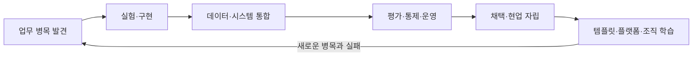

# AX Engineer 공개 역할 검토

> 확인일: 2026-07-23

## 목적

`AX Engineer`는 아직 책임 범위가 하나로 굳어진 직함이 아니다. 이 문서는 현재 공개된 채용·현장 자료에서 반복되는 책임과 차이를 확인하고, 이 로드맵이 무엇을 포함할지 설명한다.

특정 회사의 정의를 표준으로 삼거나 채용 시장 전체를 통계적으로 대표한다고 주장하지 않는다. 공개 자료가 바뀌거나 공고가 종료될 수 있으므로 링크와 확인일을 함께 기록한다.

## 검토 기준

- 누구의 어떤 업무 문제에서 시작하는가
- 직접 구현하고 운영하는 범위는 어디까지인가
- 데이터·시스템·권한을 어떻게 다루는가
- 모델·에이전트 품질을 어떻게 평가하는가
- 사용자의 채택과 역할 변화를 책임지는가
- 한 사례의 학습을 어떻게 재사용하는가

## 공개 자료에서 확인한 역할 형태

### 1. 현업 임베디드형

FuriosaAI의 Compiler AX Engineer 공고는 특정 엔지니어링 팀 안에서 개발·리뷰·디버깅·CI·문서화의 병목을 찾고, AI 도구를 실제 흐름에서 실험한 뒤 반복 가능한 도구와 플레이북으로 남기는 역할을 설명한다. 도입률뿐 아니라 PR 주기, 리뷰 시간, 장애 분류 시간, CI 불안정성과 같은 업무 지표도 다룬다.

이 형태에서 중요한 역량:

- 도메인 업무를 직접 관찰하고 병목을 구조화하는 능력
- 도구를 기능 목록이 아니라 실제 기준선과 비교하는 능력
- 팀별 템플릿·통합·가이드를 운영하는 능력
- 교육과 채택 지표를 기술 결과와 함께 보는 능력

출처:

- [`PRIMARY_OFFICIAL` FuriosaAI, Software Engineer, Compiler (AX Engineer)](https://jobs.ashbyhq.com/furiosa-ai/11eafd2e-d89b-4c61-bb64-b38cf0748536/) — 2026-07-23 확인

### 2. 조직 운영 기반형

Lunit의 Senior AX Engineer 공고는 승인 흐름, 사내 정책 질의, 협업 도구와 데이터 연결, 워크플로우 SDK·런타임을 하나의 조직 운영 기반으로 다룬다. 한 팀이 모든 앱을 만드는 대신 비개발 직군도 허용된 범위에서 워크플로우를 만들 수 있는 환경을 목표로 둔다.

이 형태에서 중요한 역량:

- 여러 원본 시스템의 데이터·식별자·권한 연결
- 에이전트 실행, 평가, 승인, 감사, 복구의 공통 계약
- 새 업무를 추가할 수 있는 SDK·템플릿·런타임
- 중앙 기반과 팀별 자율성의 경계
- 보안·거버넌스·운영을 구현과 함께 다루는 능력

출처:

- [`PRIMARY_OFFICIAL` Lunit, Senior AX Engineer](https://apply.workable.com/lunit/j/E3C22F589F/) — 2026-07-23 확인

### 3. 현업 자립·확산형

Rapport Labs의 AX팀 공개 글은 구성원이 AI를 실제 업무에 쓰며 막히는 지점을 활용 세션과 일대일 지원으로 함께 해결하는 과정을 설명한다. 단순한 도구 소개보다 실제 업무 문제와 사용자가 스스로 다음 문제를 풀 수 있는 상태에 초점을 둔다.

이 로드맵은 이 사례에서 다음 역량을 도출한다.

- 사용하지 않는 이유를 기술·업무·신뢰·접근성 문제로 나눠 보는 능력
- 오피스아워, 가이드, 사례, 지원 채널을 운영하는 능력
- 현업이 직접 만들거나 수정할 안전한 범위를 설계하는 능력
- 반복해서 막히는 지점을 가이드·지원 방식·기술 기반의 개선 후보로 기록하는 능력

출처:

- [`PRIMARY_OFFICIAL` Rapport Labs, 월간 AX: AI를 실제로 쓰게 만들려면?](https://blog.rapportlabs.kr/%EC%9B%94%EA%B0%84-ax-ai%EB%A5%BC-%EC%8B%A4%EC%A0%9C%EB%A1%9C-%EC%93%B0%EA%B2%8C-%EB%A7%8C%EB%93%A4%EB%A0%A4%EB%A9%B4-156677) — 2026-07-23 확인

## 반복해서 나타난 공통 책임

세 자료의 조직·도메인·숙련도는 다르지만 다음 흐름은 반복된다.

공통 책임:

1. AI 적용 전에 업무 문제와 기준선을 확인한다.
2. 프로토타입을 실제 시스템과 권한 구조에 연결한다.
3. 모델 출력뿐 아니라 실행·승인·장애·비용을 운영한다.
4. 교육과 문서화를 부가 업무가 아니라 채택의 일부로 본다.
5. 한 번의 해결을 템플릿, 플레이북, SDK, 공통 기반으로 남긴다.

## 서로 다른 부분

| 차이 | 현업 임베디드형 | 조직 운영 기반형 | 현업 자립·확산형 |
|---|---|---|---|
| 첫 번째 사용자 | 특정 도메인 팀 | 여러 부서와 내부 빌더 | AI 활용을 시작하거나 막힌 구성원 |
| 주된 산출물 | 업무별 도구·통합·플레이북 | 데이터·실행·평가·권한 기반 | 가이드·지원 체계·재사용 사례 |
| 대표 위험 | 국소 최적화와 중복 구현 | 플랫폼 우선과 과도한 추상화 | 교육 횟수를 업무 변화로 오인 |
| 확장 방식 | 인접 업무에서 패턴 재사용 | 공통 계약과 셀프서비스 | 현업 자립과 반복 문의 감소 |

하나의 채용 공고가 세 형태를 모두 포함하기도 한다. 이 표는 직무를 세 개로 나누기 위한 분류가 아니라, 어떤 책임이 강조됐는지 확인하기 위한 관점이다.

[역할 모델](../roadmap/role-model.md)의 세 가지 운영 모델은 조직이 AX Engineer를 어디에 배치하는지를 다룬다. 이 문서의 세 형태는 공개 자료에서 어떤 책임이 강조됐는지를 다루므로 서로 독립적이며 조합할 수 있다.

## 이 로드맵의 편집 결정

### 조직 내부 AX를 범위로 둔다

이 저장소는 제품 회사가 외부 고객 환경에 솔루션을 배포하는 커리어 트랙을 다루지 않는다. 같은 기술을 쓰더라도 조직 관계, 성공 기준, 재사용 경로, 인수인계 책임이 다르기 때문이다.

### 도구보다 배포 책임을 학습 단위로 삼는다

프롬프트, RAG, 에이전트, 자동화 도구는 필요한 역량이지만 직무 전체를 설명하지 않는다. 문제 발견부터 운영·채택·표준화까지 한 업무를 끝까지 연결하는 증거를 학습 단위로 사용한다.

### 개인 역량과 조직 성숙도를 분리한다

뛰어난 한 사람이 사례를 만들었다고 조직이 전환된 것은 아니다. 개인의 숙련도, 한 업무의 전환 생애주기, 조직의 AX 성숙도를 서로 다른 지도로 관리한다.

### 공통 하네스를 최소 작업 계약으로 정의한다

같은 모델·프레임워크·UI를 강제하지 않는다. 기준 데이터, 입력·출력, 검증, 승인, 기록, 권한, 복구의 호환성을 맞춘다. 실제로 두 번째 업무에서 재사용한 증거가 생기기 전에는 전사 표준으로 확정하지 않는다.

### 채용 공고를 영구 진실로 취급하지 않는다

공고는 특정 시점과 조직의 필요를 반영한다. 역할 정의의 유일한 근거로 쓰지 않고, 현장 사례·운영 산출물·기여자의 반례를 함께 축적한다.
