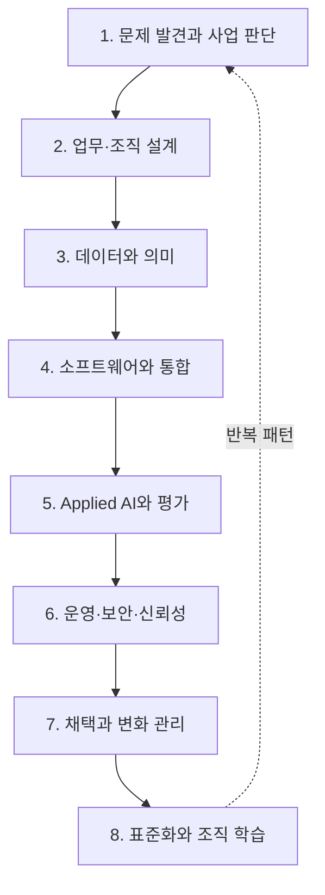

# AX Engineer 역량 지도

## 1. 역량 구조

AX Engineer의 역량은 여덟 영역으로 나눈다. 모든 영역을 같은 깊이로 다룰 필요는 없지만, 한 업무를 운영에 배포하려면 각 영역의 책임자가 누구인지 설명할 수 있어야 한다.

## 2. 문제 발견과 사업 판단

### 알기

- 업무 목표, 사용자 목표, 기술 목표의 차이
- 기준선과 성공 지표
- 선행지표와 후행지표
- 자동화 비용, 실패 비용, 미실행 비용

### 판단하기

- AI를 적용할 문제인지, 절차를 제거하거나 단순화할 문제인지 구분한다.
- 가치가 커도 데이터·권한·복구가 준비되지 않은 업무는 보류한다.
- 구현·개선·유지·중단 중 하나를 근거로 선택한다.

### 해보기

- 현업 인터뷰 또는 공개 사례를 바탕으로 업무 발굴 카드 세 장을 작성한다.
- 서로 다른 후보를 가치·빈도·데이터·위험·복구 가능성으로 비교한다.
- 도구 이름 없이 성공과 중단 조건을 설명한다.

### 증명하기

- 목표 계약
- 기준선과 지표 정의
- 업무 후보 평가표
- 범위와 비목표가 포함된 결정 기록

### 실패 패턴

- 경영진의 아이디어를 검증 없이 문제 정의로 사용
- 토큰 수·사용자 수·생성 건수를 사업 성과로 사용
- 절감 시간을 측정하지만 그 시간이 어디에 쓰이는지 확인하지 않음

## 3. 업무·조직 설계

### 알기

- 시작 신호, 담당자, 입력, 판단, 산출물, 예외, 인수인계
- 업무 책임자와 시스템 운영자의 차이
- 현재 흐름과 목표 흐름
- 이중 운영과 기존 절차 종료 조건

### 판단하기

- 사람의 판단을 유지할 단계와 규칙으로 표준화할 단계를 구분한다.
- 부서 경계를 넘는 인수인계에서 필요한 최소 정보를 결정한다.
- 중앙 AX팀이 영구 병목이 되는 구조를 발견한다.

### 해보기

- 실제 또는 시뮬레이션 업무의 현재 흐름을 그린다.
- 제거·통합·표준화·AI 보조·승인·자동 실행으로 단계를 다시 분류한다.
- 책임 배분표와 운영 인수인계 계획을 작성한다.

### 증명하기

- 현재/목표 업무 흐름
- 책임 배분표
- 예외·수동 대체 경로
- 기존 절차 종료 결정

### 실패 패턴

- 기존 단계마다 AI를 하나씩 붙임
- “사람이 검토한다”만 적고 검토 기준과 책임자를 정의하지 않음
- 새 도구는 도입했지만 공식 절차와 KPI는 그대로 둠

## 4. 데이터와 의미

### 알기

- 원본 시스템과 파생 데이터
- 스키마, 데이터 계약, 최신성, 계보
- 업무 용어와 지표 정의
- 정형·비정형 데이터의 품질과 표본 편향

### 판단하기

- 문서 검색과 실시간 업무 상태를 같은 저장 방식으로 처리하지 않는다.
- 복제할 데이터와 원본에서 조회할 데이터를 구분한다.
- 누락·충돌·오래된 데이터가 결과에 미치는 영향을 설명한다.

### 해보기

- 한 업무의 원본·가공·분석·실행 결과를 분리한다.
- 데이터 계약과 용어집을 작성한다.
- 누락, 중복, 지연, 권한 오류를 재현하는 평가 데이터를 만든다.

### 증명하기

- 데이터·스키마 계약
- 원본 시스템과 소유자 지도
- 용어집과 지표 정의
- 데이터 품질 보고서

### 실패 패턴

- 벡터 데이터베이스를 회사의 사실 저장소처럼 취급
- 출처와 수집 범위를 지운 뒤 모델 정확도만 비교
- 같은 용어를 팀마다 다른 뜻으로 쓰는데 프롬프트로 해결

## 5. 소프트웨어와 통합

### 알기

- API, 인증·인가, 이벤트, 큐, 웹훅, 배치
- 관계형 데이터 모델과 트랜잭션
- 재시도, 중복 방지, idempotency
- 테스트, CI/CD, 설정·시크릿 관리

### 판단하기

- 동기·비동기 실행과 배치·이벤트 방식을 업무 요구에 맞게 선택한다.
- 빠른 실험 코드와 운영 코드의 경계를 정한다.
- 기존 SaaS를 유지할지 별도 UI나 서비스를 만들지 결정한다.

### 해보기

- 두 개 이상의 기존 시스템을 연결한 얇은 수직 기능을 만든다.
- 인증, 권한, 실패 처리, 중복 방지, 감사 로그를 포함한다.
- 다른 개발자가 로컬 또는 테스트 환경에서 재현하게 한다.

### 증명하기

- 실행 가능한 코드와 테스트
- API·이벤트 계약
- 배포 파이프라인
- 운영 및 개발자 인수인계 문서

### 실패 패턴

- 데모에서는 동작하지만 상태·권한·실패를 저장하지 않음
- 자동 재시도가 외부 작업을 중복 실행
- 특정 담당자의 로컬 환경과 개인 계정에 의존

## 6. Applied AI와 평가

### 알기

- 모델 입력·출력과 비결정성
- 검색·RAG·도구 호출·에이전트 패턴
- 오프라인 평가와 운영 평가
- 정확성, 근거성, 안전성, 지연시간, 비용

### 판단하기

- 결정적 규칙·검색·분류·생성·에이전트 중 필요한 수준을 선택한다.
- 평가할 수 없는 요구사항을 운영에 배포하지 않는다.
- 모델 성능 개선과 업무 결과 개선을 구분한다.

### 해보기

- 정상·경계·실패 사례를 포함한 평가 세트를 만든다.
- 모델·프롬프트·검색·도구 변경 전후 회귀 평가를 실행한다.
- 위험한 결과를 중단하거나 사람에게 넘기는 규칙을 구현한다.

### 증명하기

- 평가 데이터와 판정 기준
- 평가 실행 결과와 회귀 기록
- 모델·프롬프트·도구 버전
- 실패 분류와 개선 결정

### 실패 패턴

- 좋은 예시 몇 개를 본 뒤 품질을 확정
- LLM 평가 점수를 사람 검토 없이 절대 기준으로 사용
- 모델 출력 품질이 좋다는 이유로 실행 권한까지 확대

## 7. 운영·보안·신뢰성

### 알기

- 최소 권한, 데이터 분류, 시크릿 관리
- 로그·메트릭·트레이스와 감사 기록
- SLO, 장애 대응, 롤백, 수동 대체 경로
- 비용 한도와 사용량 통제

### 판단하기

- 업무 위험에 따라 AI 자율성 수준과 승인 지점을 정한다.
- 자동 재시도, 즉시 중단, 사람 인계 중 하나를 실패 유형별로 선택한다.
- 기록해야 할 데이터와 저장하면 안 되는 데이터를 구분한다.

### 해보기

- 권한 오류, 외부 API 장애, 오래된 데이터, 잘못된 출력을 주입한다.
- 경보·중단·복구·롤백 흐름을 실행한다.
- 운영자가 문제 원인과 영향을 같은 식별자로 추적하게 한다.

### 증명하기

- 위협 모델과 권한표
- 운영 대시보드 또는 상태 보고
- 장애·복구 훈련 기록
- 비용·품질·안정성 점수표

### 실패 패턴

- 대화 기록을 감사 로그로 착각
- 실패하면 사람이 해결한다고만 정의
- 관측성 없이 자율 실행 범위를 확대

## 8. 채택과 변화 관리

### 알기

- 사용자 수용 테스트
- 교육, 지원, 현장 챔피언
- 이중 운영, SOP 변경, 역할 재설계
- 채택과 만족도, 업무 결과의 차이

### 판단하기

- 사용하지 않는 이유가 교육, 신뢰, 접근성, 프로세스 충돌 중 무엇인지 구분한다.
- 현업이 수정할 영역과 엔지니어링 변경이 필요한 영역을 나눈다.
- 기존 절차를 유지·종료할 시점을 결정한다.

### 해보기

- 구현자 외의 운영자가 설명 없이 핵심 흐름을 수행하게 한다.
- 사용자 피드백을 기능 요청과 업무 문제로 분리한다.
- 교육·지원·인수인계와 종료 조건을 운영한다.

### 증명하기

- 사용자 검수 기록
- 교육·지원 문서
- 업무 채택 지표
- 기존 절차 종료 또는 유지 결정

### 실패 패턴

- 로그인 수나 생성 건수만 채택으로 판단
- 현업 저항을 변화 의지가 부족한 문제로 단정
- AX팀이 모든 예외와 수정 요청을 영구 처리

## 9. 표준화와 조직 학습

### 알기

- 일회성 요구와 반복 패턴
- 구성 가능성, 확장 지점, 버전 호환성
- 공통 기반 피드백과 플랫폼 백로그
- 사례 재현과 근거 기록

### 판단하기

- 한 사례에서만 나온 요구를 공통 기능으로 올리지 않는다.
- 공통 규격과 팀 자율성의 경계를 정한다.
- 운영 실패를 재현 가능한 공통 기반 문제로 변환한다.

### 해보기

- 두 번째 업무에서 기존 계약과 구성 요소를 재사용한다.
- 재사용되지 않은 부분과 그 이유를 기록한다.
- 새로운 업무를 추가하는 데 든 시간·변경 범위·운영 부담을 비교한다.

### 증명하기

- 재사용 모듈과 버전 정책
- 플레이북과 템플릿
- 공통 기반 또는 플랫폼 피드백
- 사례 간 비교와 확장·중단 결정

### 실패 패턴

- 첫 사례의 구조를 곧바로 전사 표준으로 선언
- 공통 하네스를 같은 프레임워크와 UI로 강제
- 현장별 예외를 모두 코어 기능에 포함

## 10. 자기 진단

각 영역에서 가장 높은 단계가 아니라, **다른 사람이 확인할 수 있는 증거가 있는 단계**를 현재 수준으로 기록한다.

| 역량 | 알기 | 판단하기 | 해보기 | 증명하기 | 다음 증거 |
|---|---:|---:|---:|---:|---|
| 문제 발견과 사업 판단 |  |  |  |  |  |
| 업무·조직 설계 |  |  |  |  |  |
| 데이터와 의미 |  |  |  |  |  |
| 소프트웨어와 통합 |  |  |  |  |  |
| Applied AI와 평가 |  |  |  |  |  |
| 운영·보안·신뢰성 |  |  |  |  |  |
| 채택과 변화 관리 |  |  |  |  |  |
| 표준화와 조직 학습 |  |  |  |  |  |
