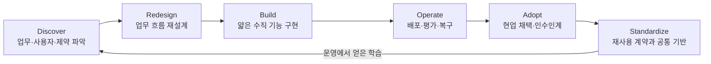

# AX Engineer 역할 모델

## 1. 이 저장소의 정의

**AX Engineer**는 조직 내부의 업무 문제를 발견하고, 프로세스를 다시 설계하며, AI를 기존 데이터·시스템·권한 구조에 연결해 운영 가능한 변화로 만드는 엔지니어다.

이 직무의 이름과 범위는 아직 조직마다 다르다. 어떤 회사는 현업에 밀착한 자동화 개발을 강조하고, 어떤 회사는 에이전트 실행 기반과 사내 데이터 통합을 맡긴다. 도구 운영·교육·확산의 비중이 큰 공고도 있다.

따라서 이 로드맵은 직함보다 다음 책임이 실제로 포함되는지를 본다.

- 업무 병목 발견과 기술 범위 설정
- 현재 업무의 제거·단순화·표준화·AI 적용 판단
- 기존 데이터·시스템과의 통합
- 직접 구현과 운영 배포
- 평가·보안·관측성·복구
- 현업 채택과 운영 인수인계
- 반복 가능한 패턴의 공통 기반화

현재 공개된 역할 설명을 검토한 근거는 [AX Engineer 공개 역할 검토](../research/ax-engineer-role-review.md)에 정리한다.

## 2. 책임의 끝

AX Engineer의 책임은 프로토타입이 동작할 때 끝나지 않는다. 업무 결과와 운영 책임이 연결되고, 다른 사람이 안전하게 이어받을 수 있을 때 한 사이클이 끝난다.

각 단계에서 AX Engineer가 모든 결정을 독점한다는 뜻은 아니다. 업무 책임자, 데이터 소유자, 보안·법무, 기존 시스템 운영자와 함께 판단하되 기술적 결과와 운영 증거를 연결할 책임을 진다.

## 3. 세 가지 운영 모델

조직 규모와 AX 성숙도에 따라 역할 배치는 달라진다.

| 운영 모델 | AX Engineer의 위치 | 강점 | 주의할 점 |
|---|---|---|---|
| 현업 임베디드 | 특정 부서·도메인 팀 안 | 실제 병목과 사용자 피드백에 가깝다 | 팀별 고립과 중복 구현 |
| 중앙 AX팀 | 전사 플랫폼·혁신 조직 | 데이터·권한·평가·실행 기반을 공통화하기 쉽다 | 현업 문제보다 플랫폼 구축이 앞설 위험 |
| 허브 앤드 스포크 | 중앙 기반팀을 허브로 두고 현업 빌더가 분담 | 공통 통제와 현업 속도를 함께 가져갈 수 있다 | 책임과 지원 경계가 흐려질 위험 |

초기에는 한 사람이 세 모델의 일을 모두 맡을 수 있다. 사례가 늘어나면 업무 발견·구현·운영·지원이 한 병목에 쌓이지 않도록 책임을 나눠야 한다.

이 표는 AX Engineer를 조직 안에 어디에 배치할지 설명한다. 개인이 실제로 맡는 업무 전환·기반·확산 책임의 비중과는 별개 축이며, 한 운영 모델 안에서도 여러 책임 조합이 가능하다.

## 4. 역할 안의 세 가지 책임 축

### 업무 전환

- 현업의 실제 흐름, 예외, 대기, 인수인계를 관찰한다.
- AI를 붙이기 전에 없애거나 단순화할 단계를 찾는다.
- 목표, 기준선, 성공·중단 조건을 업무 책임자와 합의한다.
- 공식 절차, 역할, KPI가 새 방식과 충돌하지 않게 조정한다.

### 엔지니어링 기반

- 데이터 원본, 업무 용어, 접근 권한, 시스템 경계를 연결한다.
- 모델·검색·규칙·도구 호출을 필요한 수준만 선택한다.
- 평가, 실행 기록, 승인, 관측성, 비용 한도, 복구를 구현한다.
- 반복되는 계약과 구성 요소를 공통 하네스로 만든다.

### 채택과 조직 학습

- 사용자가 직접 대표 흐름과 예외를 수행하게 한다.
- 교육, 지원, 수정 권한, 인수인계 기준을 설계한다.
- 사용량과 업무 결과를 구분해 본다.
- 성공뿐 아니라 실패·중단·폐기 이유도 다음 업무의 기준으로 남긴다.

한 직무가 세 축을 모두 깊게 맡아야 한다는 뜻은 아니다. 다만 한 업무를 운영에 배포하려면 각 축의 책임자가 누구인지 설명할 수 있어야 한다.

## 5. 역할 경계

AX Engineer는 조직 변화의 단독 책임자가 아니다.

| 책임 | 주된 소유자 | AX Engineer의 역할 |
|---|---|---|
| 업무 목표와 최종 판단 | 업무 책임자 | 목표를 측정 가능하게 만들고 기술 제약을 설명 |
| 원본 데이터의 정의와 품질 | 데이터 소유자 | 계약·검사·누락 처리 설계 |
| 보안 정책과 예외 승인 | 보안·법무 책임자 | 위협과 접근 경로를 문서화하고 통제 구현 |
| 기존 시스템의 안정성 | 시스템 운영자 | 통합·실패·복구 방식을 공동 설계 |
| AI 업무 시스템 구현 | AX·엔지니어링 책임자 | 직접 구현하거나 공동 구현하고 운영 증거 제공 |
| 현업 채택과 절차 변경 | 조직·업무 책임자 | 검수·교육·지원·이중 운영·종료 조건 설계 |
| 공통 기반과 투자 순서 | AX 리드·경영 책임자 | 사례 근거와 기술 부채를 바탕으로 선택지 제시 |

다음 업무를 AX Engineer에게 자동으로 맡기지 않는다.

- 근거 없이 전사 AI 전략과 성과 목표를 단독으로 확정하는 일
- 데이터 소유자 대신 업무 용어와 원본 기준을 정하는 일
- 보안·법무 책임자 대신 위험 예외를 승인하는 일
- 사용자의 모든 문의와 수동 업무를 영구적으로 대신하는 일
- 복구·승인 기준 없이 에이전트 권한을 확대하는 일

## 6. 좋은 AX Engineer 역할을 확인하는 질문

- 첫 90일에 기대하는 업무 결과는 무엇인가?
- 문제 발견, 구현, 운영, 확산 중 어디까지 직접 책임지는가?
- 기존 시스템과 데이터에 접근할 권한과 협업 경로가 있는가?
- 업무 우선순위와 중단을 결정하는 사람은 누구인가?
- 보안·데이터·현업 책임자와 어떤 방식으로 협업하는가?
- 배포 후 품질·비용·장애·사용자 지원은 누가 운영하는가?
- 한 번의 구현을 공통 기반으로 만드는 경로가 있는가?
- 현업이 직접 수정할 수 있는 범위와 엔지니어링 변경의 경계는 무엇인가?
- 기존 절차를 종료하거나 새 시스템을 폐기할 기준이 있는가?

## 7. 역할 정의의 위험 신호

- 성공 기준이 “AI를 많이 쓰게 한다”에 머문다.
- 문제를 찾을 권한은 없고 들어오는 자동화 요청만 처리한다.
- 운영 시스템을 만들라고 하면서 데이터·권한·배포 접근은 없다.
- 보안과 승인은 다른 팀이 알아서 처리한다고 가정한다.
- 사용자가 정착하지 않아도 기능 출시를 완료로 본다.
- 공통 플랫폼을 요구하지만 두 번째 업무에서의 재사용 증거가 없다.
- 중앙 AX팀이 모든 수정·지원·예외 처리의 영구 담당자가 된다.
